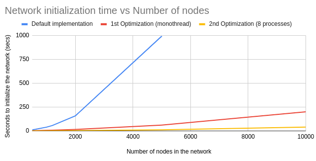

# py-dht &middot; 
small and straightforward representation of how a kademlia-based dht could be integrated into ethereum, particularly at [das-research](https://github.com/codex-storage/das-research).

## What can this dht do?
the current work on this simulation of a kademlia-based dht network offers: 

- [`DHTNewtork`](https://github.com/cortze/py-dht/blob/f5a1c27735bececf75942b54a7426aabf2fd28e7/dht/dht.py#l235) object 
  that can: spawn `dhtclients`, serve as main source to initialize the `routing table` of the `dhtclients`,  resolve 
  `connections` between `dhtclients`, handle and keep track of the interactions between `dhtclients`. the parameters to 
  configure the a `dhtnetwork` are:
  - `networkid`: in case we want to simulate different network at the same time
  - `errorrate`: to define the number connections that will fall into an error (we can understand it as the likelines o
  f an error in %)
  - `delayrage`: range between the slowest possible delay and the biggest one. a random delay will be selected every 
  time a connection is stablished between 2 nodes (if no error is raised) 

  the network offers the following functions:
  - `parallel_clilist_initializer`
  - `init_with_random_peers` initializes a network using a "blazingly fast" method, which can be optimized even more if 
  a number of threads/processes is defined 
  - `add_new_node` adds a new node to the local `Network`
  - `connect_to_node` returns the `Connection` obj between node `A` and `B`
  - `bootstrap_node` return the "best" nodes/dhtclis to compose the routing table for the given node 
  - `summary` return the summary of the current status of the network (number of nodes, successful connections, failed 
  ones, etc), will evolve over time

    
- [`Connection`](https://github.com/cortze/py-dht/blob/f5a1c27735bececf75942b54a7426aabf2fd28e7/dht/dht.py#l211) 
  interface that limits how two `dhtclients` interact with each other (like if it was a closed api/protocol). 
  it offers the possibility to client `a` (client starting the connection) to ask client `b` (remote client), applying 
  if specified the delay at the moment of stablishing the connection and per each interaction: 
  - `get_closest_nodes_to(hash)` will return the k closest nodes to the given `hash` that client `b` has in it's routing 
  table. _note: it will also return the value if it's stored locally :)_ 
  
  - `store_segment(segment)` will add the `hash` and the segment as a key-value pair in `b`'s local storage 
  - `retrieve_segment(hash)` will ask `b` to return the segment of the given `hash` if it has it


- [`DHTClient`](https://github.com/cortze/py-dht/blob/f5a1c27735bececf75942b54a7426aabf2fd28e7/dht/dht.py#l14) as 
  representation of a node in the simulated dht network. the `dhtclient` can be created using the following parameters: 
  - `nodeid`: id of the node that hosts the `dhtclient`
  - `network`: referece to the network obj that where the `dhtclient` participates in
  - `kbucketsize`: k value, number of nodes per kbucket
  - `a`: number of concurrent node connections the client does while looking for a given key
  - `b`: target of nodes (number of nodes) returned when asking for a `hash` 
  - `steptostop`: number of iterations without finding anyone closer to stop the `lookup` operation
  
  the client serves a list of endpoints such as:
  - `bootstrap` uses the network reference to find the right peers for the routing table
  - `lookup_for_hash` will try to look the value of the `hash` in the network, and the closest nodes to it  
  - `get_closest_nodes_to` will return the closest nodes to a `hash` from the local routing table
  - `provide_block_segment` will lookup for the closest nodes in the network, and store the segment on them
  - `store_segment` will store locally a segment value using its `hash` as key
  - `retrieve_segment` will return the value of a `hash` if its locally, exception raised otherwise
  

- [`RoutingTable`](https://github.com/cortze/py-dht/blob/f5a1c27735bececf75942b54a7426aabf2fd28e7/dht/routing_table.py#L21) and 
[`KBucket`](https://github.com/cortze/py-dht/blob/f5a1c27735bececf75942b54a7426aabf2fd28e7/dht/routing_table.py#L76) classes to store locally the local representation of the network for a given node


- [`Hash`](https://github.com/cortze/py-dht/blob/main/dht/hashes.py#l9) and 
[`BitArray`](https://github.com/cortze/py-dht/blob/f5a1c27735bececf75942b54a7426aabf2fd28e7/dht/hashes.py#l44) classes 
to represent a `nodeid`/`blocksegment`/`generalobject`

## Dependencies
The source code runs mostly on plain Python libraries. However, to speed up the performance, the plain `arrays` and `dicts` 
were updated to classes from `collections`. Thus, I recomend to have an specific virtual environment to use the module.

To install the dependencies, do:
```shell
# python -m venv venv
# or
# python -m virtualenv venv
# source venv/bin/activate
(venv)$ pip install -r requirements.txt
```

## Tests
The repo has a list of tests to ensure that no functionality is broken whenever a new feature is added. All the tests are
triggered whenever GitHub records a `Push` or a `PullRequest`. However, there are locally runable using the `./launch_test.sh`
script

```shell
# the script will try to activate any `venv` located at the root of the directory
py-dht$ bash launch_tests.sh
```

## Benchmarks
Running benchmarks is a bit trickier. First install the `py-dht` module as `editable` in the `venv`
```shell
py-dht$ pip install -e ./
```
after that, feel free to change the parameters in the `benchmarks/launch_benchmarks.sh` and run it like if it was a test:
```shell
# the script will try to activate any `venv` located at the root of the directory
py-dht$ cd benchmarks
py-dht/benchmarks$ bash launch_benchmarks.sh
```

## Numbers and recomendations
From the experience of running tests and benchmarks on the repo, I can say that the optimizations on [#8](https://github.com/cortze/py-dht/pull/8) 
and [#9](https://github.com/cortze/py-dht/pull/9) were more than necesary.

*Recomendations:*
- to simulate a network -> use the `network.init_with_random_peers()` function setting the `processes` parameters
the initialization of the network is by far the process that takes the longer, as it has to compute the best routing tables
for each of the spawned nodes. So, please benefit from the concurrency to reduce the duration 
(check [this test](https://github.com/cortze/py-dht/blob/f5a1c27735bececf75942b54a7426aabf2fd28e7/tests/test_network.py#L113) as example) 
- At the moment using 20 cores of a `ryzen 5900x` I'm able to initialize a network of `10k dhtclients` with `k=20` in `28 secs`

Latest numbers of the `network becnhmark`
```shell
# 03.08.2023 
py-dht$ python benchmarks/network.py -t opt-conc -o ./csvs -i 1 -k 20 -n 10000 --threads 20
-- benchmark: opt-conc_network_n_initialization --
rounds          : 1
failed rounds   : 0
prep time (s)   : 1.5974044799804688e-05
avg (s)         : 0.09420228004455566
median (s)      : 0.09420228004455566
p90_duration (s): 0.09420228004455566
-- benchmark: opt-conc_network_bootstrap_node --
rounds          : 1
failed rounds   : 0
prep time (s)   : 0.11602234840393066
avg (s)         : 0.6563236713409424
median (s)      : 0.6563236713409424
p90_duration (s): 0.6563236713409424
-- benchmark: opt-conc_network_fast_bootstrap_network --
rounds          : 1
failed rounds   : 0
prep time (s)   : 8.344650268554688e-06
avg (s)         : 174.6814157962799
median (s)      : 174.6814157962799
p90_duration (s): 174.6814157962799
-- benchmark: opt-conc_network_fast_threaded_bootstrap_network --
rounds          : 1
failed rounds   : 0
prep time (s)   : 0.0008330345153808594
avg (s)         : 28.239949226379395
median (s)      : 28.239949226379395
p90_duration (s): 28.239949226379395
```
At the moment (after applying the code optimizations in #8 and the conncurrency #9) the numbers look like this:

| Number of nodes | Default implementation | 1st Optimization (monothread) | 2nd Optimization (8 processes) |
|-----------------|------------------------|-------------------------------|--------------------------------|
| 500             | 10                     | 2.096                         | 0.489                          | 
| 1000            | 39                     | 5.39                          | 1.02                           | 
| 1200            | 56                     | 7.22                          | 1.48                           | 
| 2000            | 157.36                 | 14.49                         | 2.83                           | 
| 5000            | 995.73                 | 60.01                         | 11.15                          | 
| 10000           | (beyond 2 hours)       | 199.97                        | 39.15                          | 
_NOTE: all the measurements displayed in the table are expresed in seconds_




## Maintainer
Mikel Cortes-Goicoechea - [@cortze](https://github.com/cortze)

## Contributing
feel free to dive in! change proposals, issues, and prs will be more than welcome.

## Support
- the work has been supported by [codex](https://github.com/codex-storage)
- feel free to support this project through [buy me a coffee](https://www.buymeacoffee.com/cortze); help me getting the ship of caffeine that I need 😊.

## License
mit, see [license](./license) file

